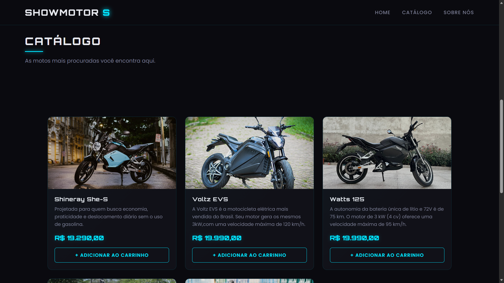
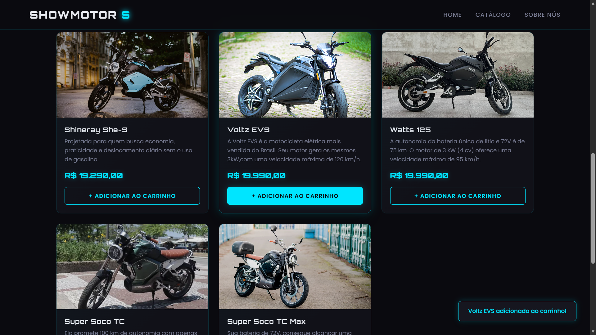
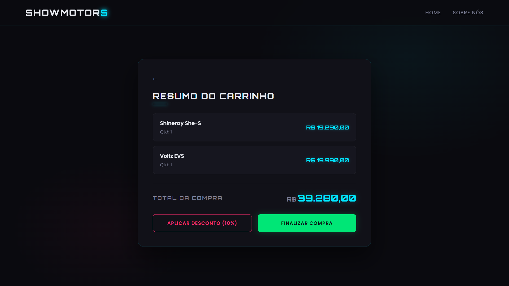

# 🏍️ ShowMotor


<p align="center">
  
</p>

<p align="center">
  
  
</p>

---

## 📌 Links

* **Repositório:** [https://github.com/Leonardo-Daniel-SC/ShowMotor](https://github.com/Leonardo-Daniel-SC/ShowMotor)
* **Projeto Online:** [https://leonardo-daniel-sc.github.io/ShowMotor](https://leonardo-daniel-sc.github.io/ShowMotor)
---

## 📖 Sobre o projeto

O **ShowMotor** é uma página web desenvolvida para apresentar um catálogo de motos elétricas modernas, oferecendo uma experiência intuitiva para explorar modelos e conhecer seus detalhes.

O projeto foi criado com o objetivo de praticar conceitos de desenvolvimento Front-end, como manipulação do DOM, renderização dinâmica de conteúdo, organização de componentes e criação de interfaces responsivas utilizando HTML, CSS e JavaScript.

---

## ✨ Funcionalidades

* 🏍️ Exibição de um catálogo de motos elétricas.
* 📋 Renderização dinâmica dos produtos com JavaScript.
* 🔎 Navegação entre as seções da página.
* 🛒 Acesso à página do carrinho.
* ℹ️ Página "Sobre nós".
* 📱 Interface responsiva.
* 🎨 Design moderno com foco na experiência do usuário.

---

## 🛠️ Tecnologias utilizadas

* HTML5
* CSS3
* JavaScript

---

## 📂 Estrutura do projeto

```text
📁 showmotor
│
├── index.html
├── README.md
│
├── pages/
│   ├── sobre.html
│   └── loja.html
│
├── src/
│   ├── css/
│   │   └── style.css
│   ├── js/
│   │   └── script.js
│   └── img/
│       ├── showmotor-1.png
│       ├── showmotor-2.png
│       └── showmotor-3.png
```

---

## ▶️ Como executar

1. Clone este repositório:

```bash
git clone https://github.com/seu-usuario/nome-do-repositorio.git
```

2. Entre na pasta do projeto:

```bash
cd nome-do-repositorio
```

3. Abra o arquivo **index.html** em seu navegador.

Ou utilize a extensão **Live Server** do Visual Studio Code.

---

## 💡 Como utilizar

1. Acesse a página inicial.
2. Navegue até a seção **Catálogo**.
3. Explore os modelos de motos elétricas disponíveis.
4. Consulte a página **Sobre nós** para conhecer a proposta da empresa.
5. Acesse a área do **Carrinho** para continuar a experiência de compra.

---

## 📚 Conceitos praticados

Durante o desenvolvimento deste projeto foram aplicados conceitos como:

* Estruturação semântica com HTML5
* Estilização responsiva com CSS3
* Manipulação do DOM
* Renderização dinâmica de elementos
* Organização de arquivos em módulos
* Navegação entre páginas
* Eventos em JavaScript
* Boas práticas de desenvolvimento Front-end

---

## 🚀 Melhorias futuras

* 🔍 Pesquisa de motos por nome.
* 🏷️ Filtros por categoria, autonomia e preço.
* ❤️ Lista de favoritos.
* 🛒 Carrinho de compras funcional.
* 💳 Simulação de checkout.
* 🌙 Tema escuro.
* 🔗 Integração com uma API para carregamento dos produtos.
* 📱 Melhor experiência em dispositivos móveis.

---
